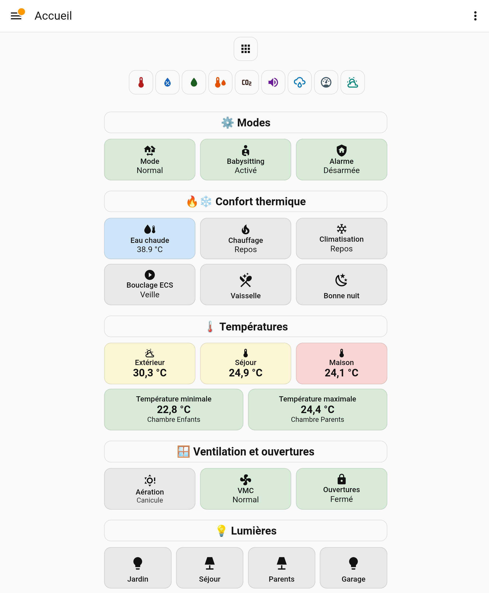
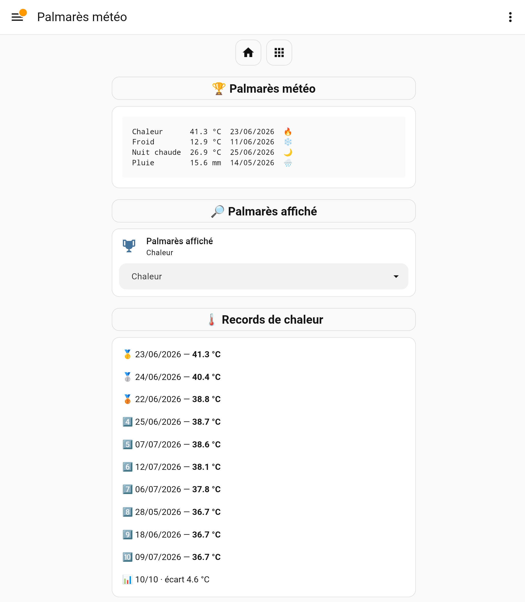
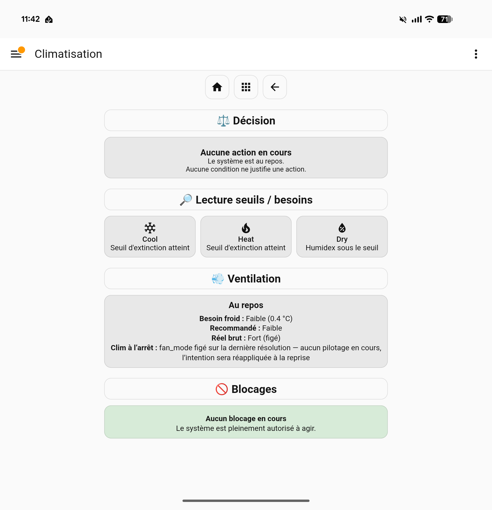
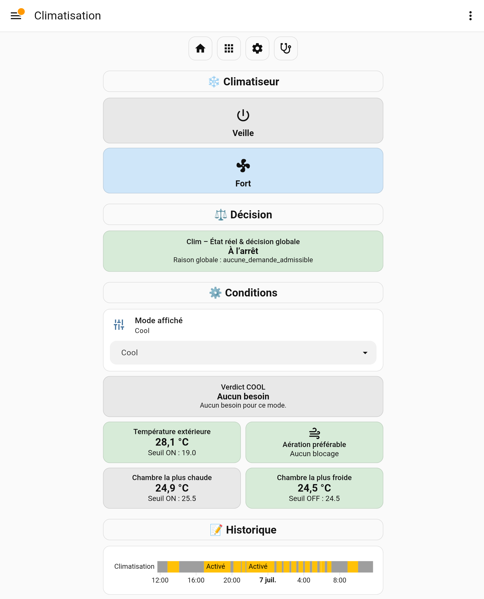
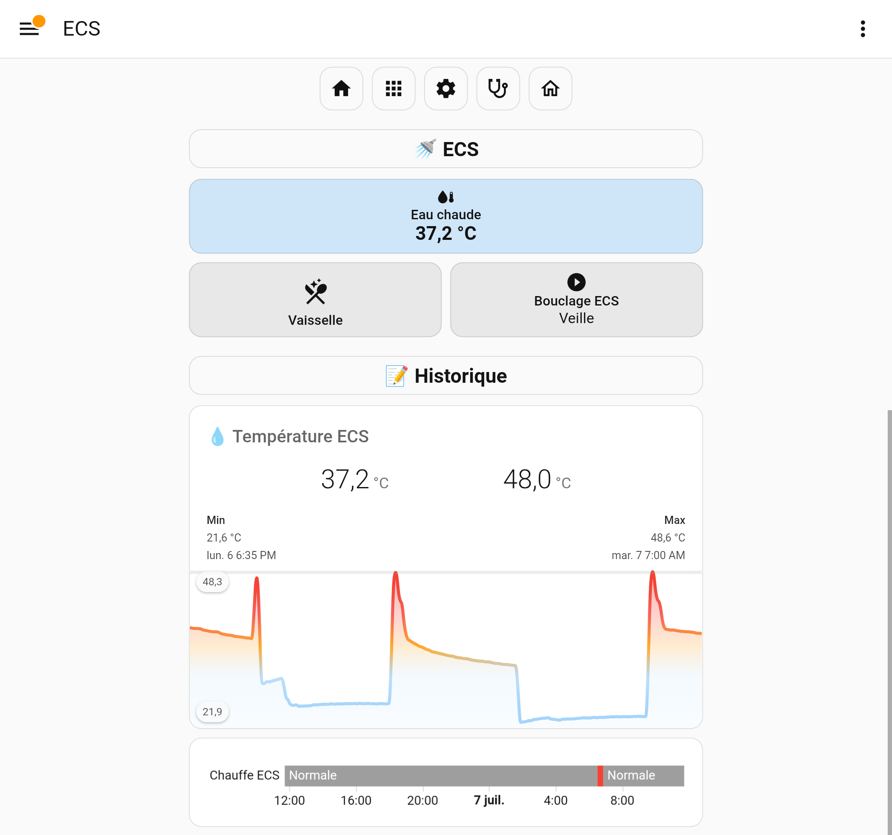
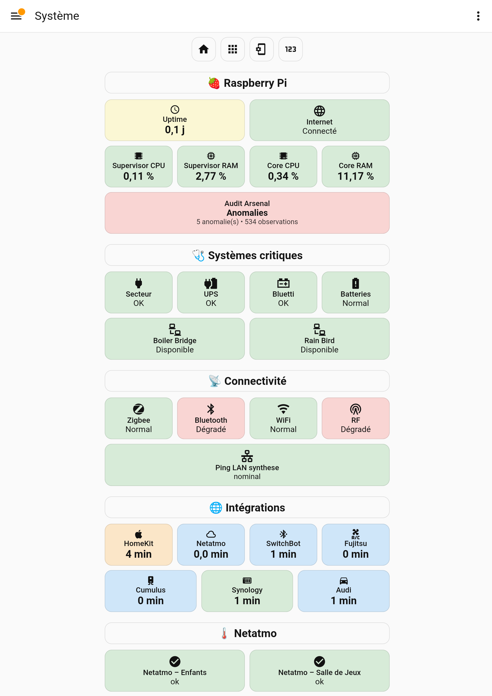
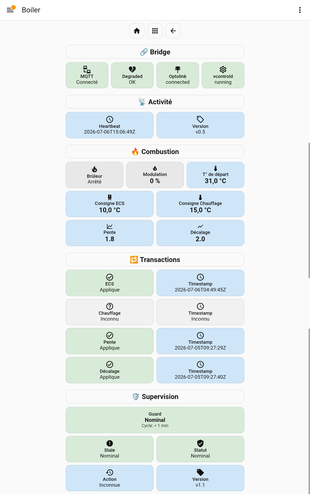

# Arsenal

> 🇫🇷 **Version française : [README.fr.md](README.fr.md)**

[](./LICENSE)
[](https://www.home-assistant.io/)
[](https://github.com/antoinevalentinHA/arsenal/actions/workflows/validation.yml)
[](https://github.com/antoinevalentinHA/arsenal/actions/workflows/doctrine.yml)
[](https://github.com/antoinevalentinHA/arsenal/actions/workflows/docs.yml)

> A real home, run by Home Assistant — and held to the standards of serious software.

**Arsenal is a real, in-production Home Assistant configuration for a family home.** It covers heating, domestic hot water, air conditioning, ventilation, irrigation, energy, security, presence, indoor and outdoor measurement, dashboards and infrastructure observability.

It is **not a framework and not a copy-paste config**. It is a complete system, observable file by file — and governed like software.

> 📖 The full documentation is written in French. This page is an English entry point; deeper documents (contracts, architecture, audits) remain in French, and each is linked below.

<br>
*Home dashboard: every domain at a glance.*

---

## What makes Arsenal different

Arsenal is built on a small set of non-negotiable principles. They are documented in the repository, not just claimed here.

- **Contract-driven architecture.** Every domain has a written contract *before* it has code. If the implementation contradicts the contract, the implementation is wrong — not the contract. See [`contrats/index.md`](00_documentation_arsenal/contrats/index.md).
- **Separation of decision, action, diagnostics and UI.** A single decision authority per domain produces readable states; bounded executors apply them; dashboards observe them. The backend decides, the UI observes — never the reverse. See [`architecture/index.md`](00_documentation_arsenal/architecture/index.md).
- **Reliable, idempotent actions.** Critical physical commands are transactional — acknowledgement, retry and guard — with monotonic timers and anti-phantom triggers, so a command is never assumed to have run. See [`contrats/boiler/`](00_documentation_arsenal/contrats/boiler/README.md).
- **Observability.** Each domain exposes a diagnostic view of its internal decision chain, and the [`recorder.yaml`](recorder.yaml) works as a documented **allowlist**: every recorded entity is there by decision, not by default.
- **Changelog-driven governance.** Changelogs are a decision memory, not a commit log — a "clean signal" reading of what actually changed. See [`changelog/index.md`](00_documentation_arsenal/changelog/index.md).
- **Real-world Home Assistant deployment.** This is a system running today in an actual house, with mains/internet outages, hardware bridges and buffer power treated as first-class domains.
- **AI-assisted engineering, human-governed.** Arsenal is not "coded by AI": it is governed by a non-developer human who uses AI as an execution force under strict constraints (no invented IDs, no casual renames, contracts bound drift, CI forbids red, the human decides). See the [French README](README.fr.md#maintenu-avec-assistance-ia).

---

## How it fits together

```
┌─────────────────────────────────────────────┐
│  Physical sensors · Integrations · MQTT     │  PERCEPTION
└───────────────────────┬─────────────────────┘
                        │ raw states
                        ▼
┌─────────────────────────────────────────────┐
│  Template sensors · Helpers · Admissibility │  DECISION
└───────────────────────┬─────────────────────┘
                        │ decision states
                        ▼
┌─────────────────────────────────────────────┐
│  Automations · Sovereign scripts            │  EXECUTION
└───────────────────────┬─────────────────────┘
                        │ commands
                        ▼
                     Hardware
```

Perception measures, decision concludes, execution applies. The UI is not part of this flow — it observes it. Layer and doctrine detail lives in [`architecture/index.md`](00_documentation_arsenal/architecture/index.md).

The governance chain is the same for every domain:

**contract → implementation → CI verification → audit → closure.**

Contracts are reference documents confronted with the code, and the discipline is **executed by the machine**: continuous integration checks each implementation against its contract. CI is a boundary, not an oracle — **red CI = forbidden, green CI = admissible to human judgement.**

---

## Interface preview

A few real views, as they run. They are **dense by design**: the UI observes states, it does not compute them.

<details>
<summary>See the screenshots</summary>

<br>
*Weather leaderboard: not today's weather but the home's climate memory — a persistent top-10 (heat, cold, warm nights, rainfall), ranked and dated on the backend, rendered read-only. Dates are French display strings derived server-side; the card applies no formatting of its own. The selector is pure interface context — it drives nothing.*

<br>
*Air conditioning — main: the backend decides and shows its verdict; the UI observes.*

<br>
*Air conditioning — diagnostic: the internal chain, thresholds and blocks. Same domain, two reading depths.*

<br>
*Domestic hot water: temperature, history and supervised recirculation loop.*

<br>
*System: infrastructure observability — Raspberry Pi, critical systems, connectivity, integrations. Unstaged: the audit is flagging 5 anomalies and two degraded links. That is exactly what a view whose job is to see is supposed to do — an observability page that has never caught anything proves nothing.*

<br>
*Boiler bridge: every physical command is transactional — acknowledgement, guard and supervision.*

</details>

---

## What you can take away

Arsenal is not copy-pasteable, but several patterns can be picked independently:

- **Decision / bounded-action separation** — doctrine in [`architecture/index.md`](00_documentation_arsenal/architecture/index.md), demonstrated in [`contrats/chauffage/`](00_documentation_arsenal/contrats/chauffage/README.md).
- **Physical commands hardened by transactional ACK** — [`contrats/boiler/`](00_documentation_arsenal/contrats/boiler/README.md).
- **Explicit state machine** instead of tangled automations — [`contrats/aeration_blocage_chauffage/`](00_documentation_arsenal/contrats/aeration_blocage_chauffage/).
- **Main / diagnostic / settings dashboard triplet** per domain — [`18_lovelace/dashboards/chauffage/`](18_lovelace/dashboards/chauffage/).
- **Persistent leaderboard rendered read-only** — a backend pipeline closes each civil day, ranks it into a top-10 (FIFO on ties) and exposes ISO dates as canonical plus French display dates as a derived attribute; the Lovelace cards only read them. The *pattern* is reusable — the YAML is not, it rests on this home's sensors, automations and helpers.
- **Documented allowlist recorder**, entity by entity — [`recorder.yaml`](recorder.yaml).

Some patterns have even been extracted into standalone public repositories, reusable without knowing anything about Arsenal:

- [`ha-self-parametrized-template-sensors`](https://github.com/antoinevalentinHA/ha-self-parametrized-template-sensors) — template sensors auto-parametrized by `this.entity_id`.
- [`ha-state-archive`](https://github.com/antoinevalentinHA/ha-state-archive) — Home Assistant state archiving, audit and versioning pipeline.
- [`ha-archive-search`](https://github.com/antoinevalentinHA/ha-archive-search) — search engine over the archived versions.

These are one-off extractions, not a framework: Arsenal stays a system, not a library.

---

## What Arsenal is *not*

- **Not an install to copy.** Entities, IPs, MQTT topics, devices and domain choices are specific to one house. What is reusable is the patterns, the invariants and the method.
- **Not a showcase.** Arsenal is not optimized for screenshots; it is optimized to stay maintainable and governable years after being built.
- **Not Home Assistant documentation.** The official docs remain the reference for integrations and Lovelace. Arsenal is about system architecture.
- **Not uniformly finished.** Some domains are closed, others mid-cycle, some unaudited — and this is written plainly in the domain map and the work registry.

---

## Documentation & navigation

The documentation is the system's source of truth. It is written in French; the main entry points are:

- [`00_documentation_arsenal/README.md`](00_documentation_arsenal/README.md) — corpus home and authority.
- [`navigation/carte_domaines.md`](00_documentation_arsenal/navigation/carte_domaines.md) — the domain map and its hubs.
- [`contrats/index.md`](00_documentation_arsenal/contrats/index.md) — the index of functional contracts.
- [`architecture/index.md`](00_documentation_arsenal/architecture/index.md) — layers, topology, doctrines.
- [`audits/index.md`](00_documentation_arsenal/audits/index.md) — the audit cycle, from reports to closures.
- [`audits/REGISTRE_CHANTIERS.md`](00_documentation_arsenal/audits/REGISTRE_CHANTIERS.md) — the piloting cockpit: what is actually open today.
- [`changelog/index.md`](00_documentation_arsenal/changelog/index.md) — the versioned history (canon).

For the full narrative — covered domains, dashboards & observability, the governance argument on the heating domain, and the AI-assisted engineering framing — read the **[French README](README.fr.md)**.

---

## Discussion

Architecture presentation and discussion on the Home Assistant forum: [Arsenal — a contract-driven architecture for Home Assistant](https://community.home-assistant.io/t/arsenal-a-contract-driven-architecture-for-home-assistant/1011597).

---

## License

MIT — the patterns are free to reuse.

Arsenal is published to share a way of architecting Home Assistant, not a house. The goal is not to be reproduced. The goal is to be studied.
